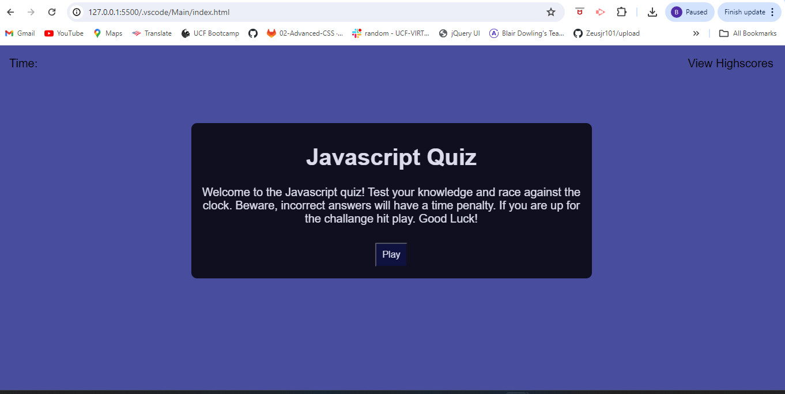

# JavaScript-Quiz

 ## Description
  This application allows users to test their Javascript knowledge is a timed quiz.  

https://github.com/Blair-D/JavaScript-Quiz

*Deployed Application:* 

  ## Table of Contents
  - [Installation](#installation)
  - [Usage](#usage)
  - [License](#license)
  - [Contact](#contact)
  

  ## Installation
  To install, navigate to my GitHub and copy the code (either http or ssh) then open GitBash and clone to your computer

  ## Usage
  This is a way to test how well you know general knowledge of Javascript. Click the play button to begin. Then select you answer to the question shown. The next question will appear automatically. Once all questions have been answered the user will be brought to the highscores page where they can enter the initials and save thier score.

  ## License
  MIT License

  ## Contact 
  If you have any question about the project or any issue please contact me [Blair0789@gmail.com](mailto:blair0789@gmail.com). Here is my Github at [Blair-D](https://github.com/Blair-D).